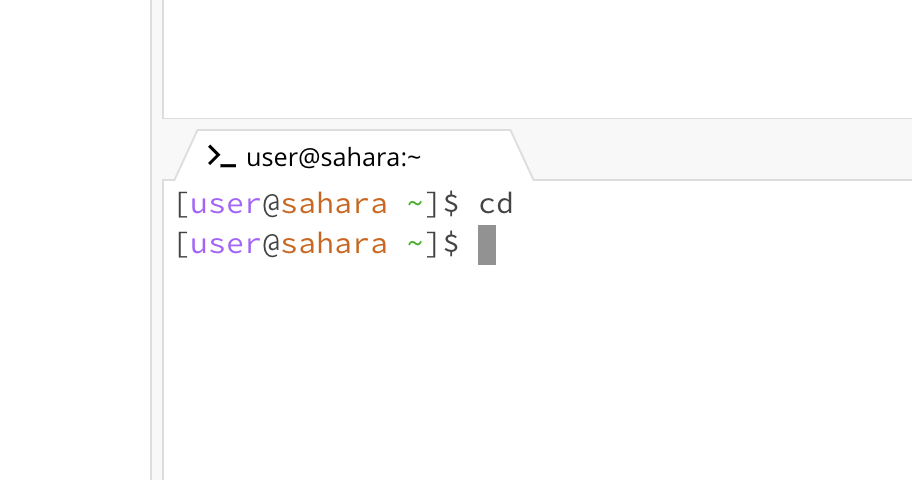
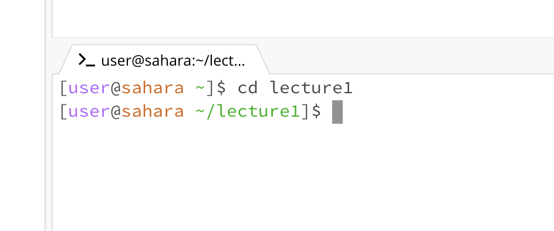
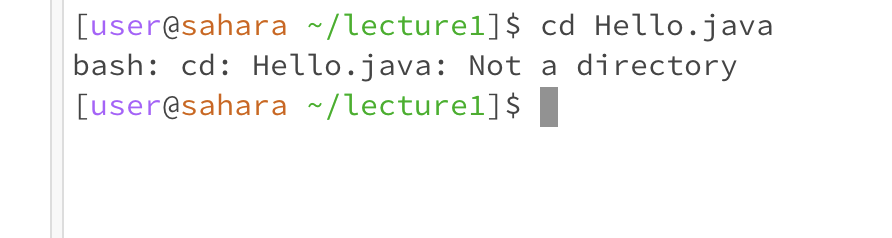
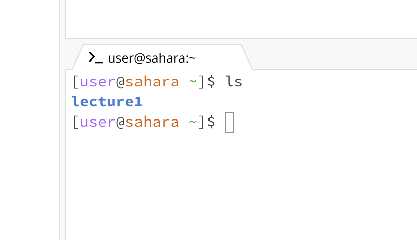
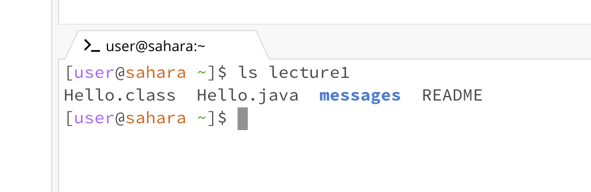
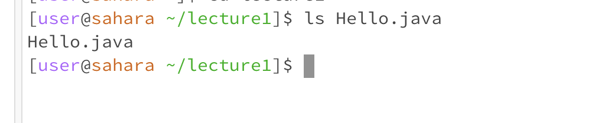
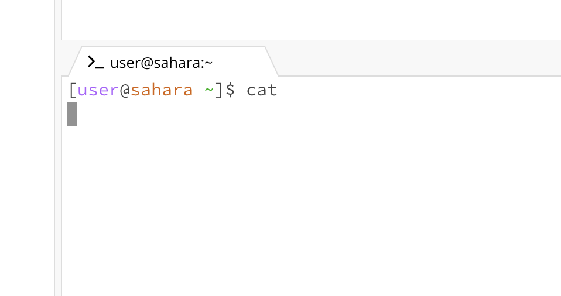
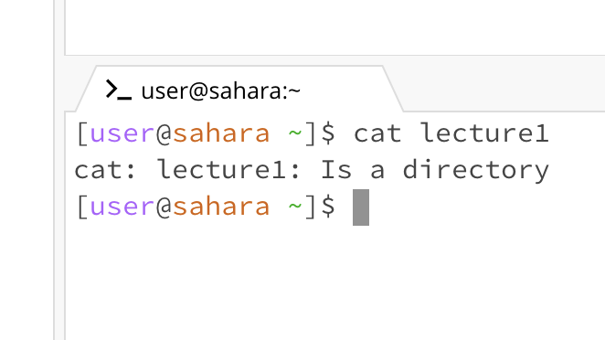
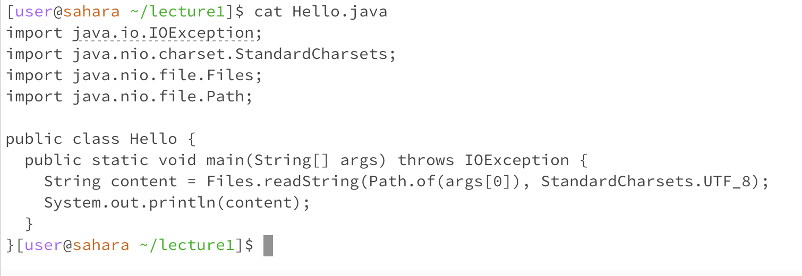

# Lab Report 1

**CD Command:**
---
- Input: None
  

1. Working Directory: /home
2. I got this output because it didn't do anything. This command is meant to change the directory you are in based on your input and because there was no input I didn't change the directory I was in.
3. This output is not an error.
   
---
- Input: Directory
  

1. Working Directory: /home
2. There wasn't an output but there was a change in the directory I was in. Before the command, I was in the directory /home, and after the command, I was in the directory /home/lecture1 . This change happened because the cd command changed the directory I was in based on my input (lecture1) 
3. This output is not an error.
   
---
- Input: File
  

1. Working Directory: /home/lecture1
2. There wasn't a change in the directory but there was an error message. The directory didn't change because I didn't give a directory as an input.
3. The output I got was an error, I got this error because I tried to run this command with a file while it was expecting a directory. 
   
---

**LS Command:**
---
- Input: None
  

1. Working Directory: /home
2. The output I got was that it printed out "lecture1". I got this output because ls is used to print out all files and directories inside your current directory or the input directory. I didn't give an input in this case so it printed everything in /home (my Working Directory)
3. This output is not an error.
   
---
- Input: Directory
  

1. Working Directory: /home
2. The output it gave printed out all the files and directories inside of /home/lecture1. I got this output because I gave ls the input lecture1 which when connected with my working directory ran the command ls /home/lecture1. This command should print all the names of the files and directories from the inputted directory which is what it did in this case.
3. This output is not an error.
   
---
- Input: File
  

1. Working Directory: /home/lecture1
2. This output printed out Hello.java, I got this output because Hello.java is a file meaning there aren't any files or directories inside of Hello.java, this ended up just printing the file name Hello.java
3. This output is not an error.
   
---

**CAT Command:**
---
- Input: None
  

1. Working Directory: /home
2. This command didn't give me an output, it caused me to not be able to type any more commands.
3. This command did give me an error. This error happened because this command is supposed to print whatever is inside of an inputted file. Because I ran this command without an input it caused an error to occur and resulted in me not being able to type any more commands in the terminal.
   
---
- Input: Directory
  

1. Working Directory: /home
2. This output printed out letting me know that lecture1 was a directory. This happened because it is expecting a file as an input and not a directory.
3. Running cat with a directory as an input did result in an error, I got this error because it expected a file and not a directory so this error let me know that the input I was providing was a directory.
   
---
- Input: File
  

1. Working Directory: /home/lecture1
2. The output I got from this command printed out the code that was inside of the Hello.java file. I got this output because the command cat takes a file as an input and prints out the contents inside of it. In this situation I was in the /home/lecture1 working directory so inputting the file Hello.java is allowed because that file is also located in the /home/lecture1 working directory. So as a result it printed out the contents inside the Hello.java file.
3. This output is not an error.
