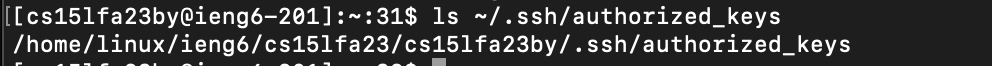
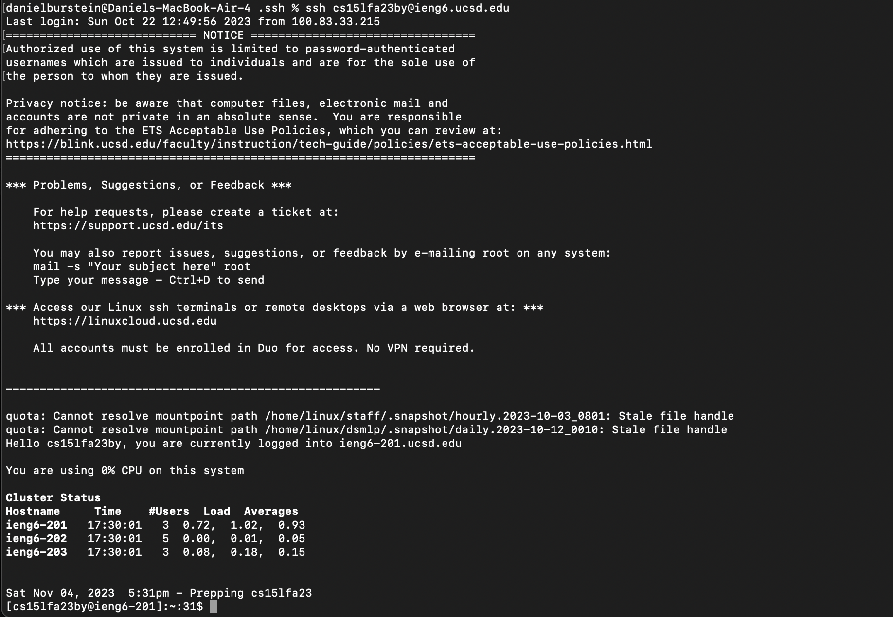

# Lab Report 2

---
**Part 1:**

StringServer code:
  

---
First /add-message:

In this screenshot we are running the url "http://localhost:4000/add-message?s=Hello"
1. Methods:
   This URL runs the method "public String handleRequest(URI url)"
2. Arguments and Values:
   This function takes in the input of "URI url" which in this case is "http://localhost:4000/add-message?s=Hello"
   We start off with the variable "String output" which is set to "" and the variable "int number" which is set to 1
   
3. Change:
  Throughout the function, we use certain temporary variables such as "String query" which holds the query in this situation being "s=Hello" and "String[] values" which splits the query at the equal sign meaning it holds "s" at position 0 and "Hello" at position 1.
The first change to the variables pre-set outside this function happens to "String output" which used to be "" and then turns into "1" and lastly goes to "1. Hello\n". After this "int number" goes from 1 to 2.

---
Second /add-message:

In this screenshot, we are running the url "http://localhost:4000/add-message?s=How%20are%20you"
1. Methods:
   This URL runs the method "public String handleRequest(URI url)"
2. Arguments and Values:
   This function takes in the input of "URI url" which in this case is "http://localhost:4000/add-message?s=How%20are%20you"
   We start off with the variable "String output" which is already "1. Hello\n" and the variable "int number" which is already 2
3. Change:
  Throughout the function, we use certain temporary variables such as "String query" which holds the query in this situation being "s=How are you"  and "String[] values" which splits the query at the equal sign meaning it holds "s" at position 0 and "How are you" at position 1.
The first change to the variables pre-set outside this function happens to "String output" which used to be "1. Hello\n" and then turns into "1. Hello\n2" and lastly goes to "1. Hello\n2. How are you". After this "int number" goes from 2 to 3.
   
---

**Part 2:**

1. Path to the private key:
   
   
   
2. Path to the public key:

   

3. Log in:

   
   
---
**Part 3:**

One thing I learned from this week's lab was how to set up an SSH key and authorize myself to not need to use a password when connecting to the remote server. I didn't think this was even possible before this lab and think that its really cool that we are able to do this.
