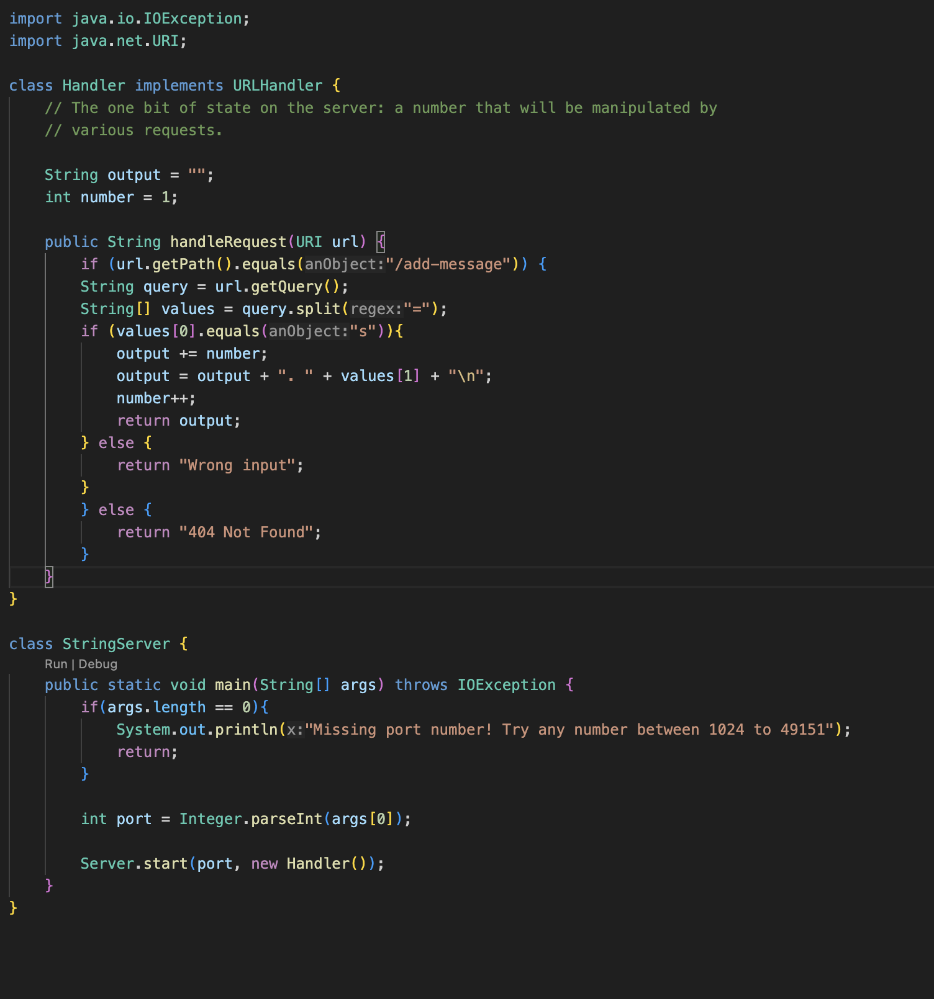
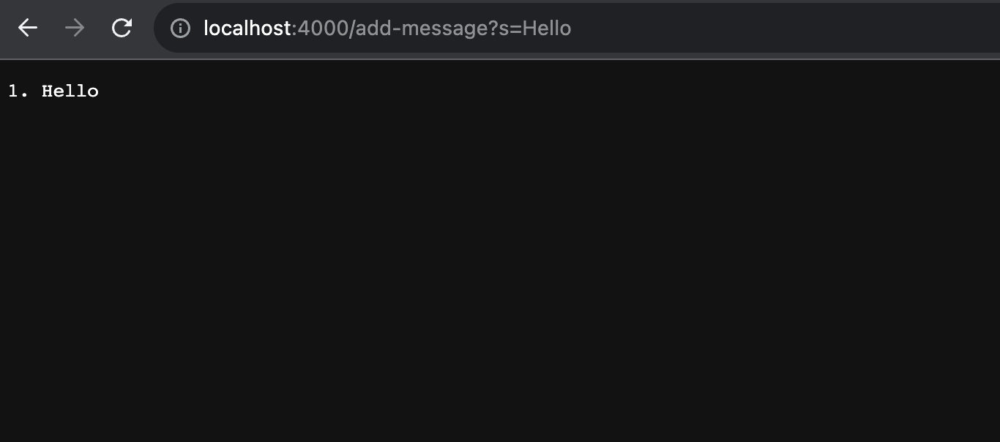
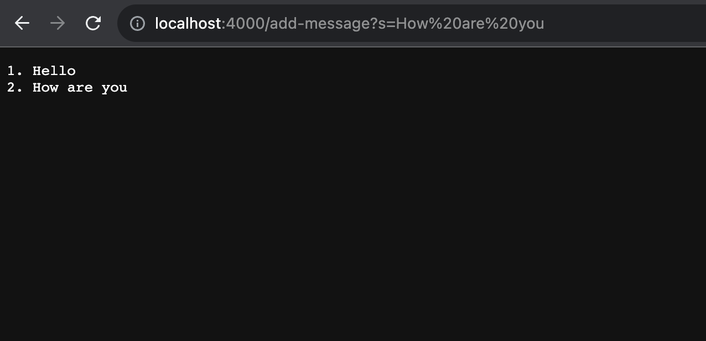

# Lab Report 2

---
**Part 1:**

StringServer code:
  

---
First /add-message:

1. Methods:
2. Arguments and Values:
3. Change:

---
Second /add-message:

1. Methods:
2. Arguments and Values:
3. Change:
   
---

**Part 2:**

1. Path to the private key:
   
2. Path to the public key

3. Log in:
   
---
**Part 3:**

One thing I learned from this week's lab was how to set up an SSH key and authorize myself to not need to use a password when connecting to the remote server. I didn't think this was even possible before this lab and think that its really cool that we are able to do this.
