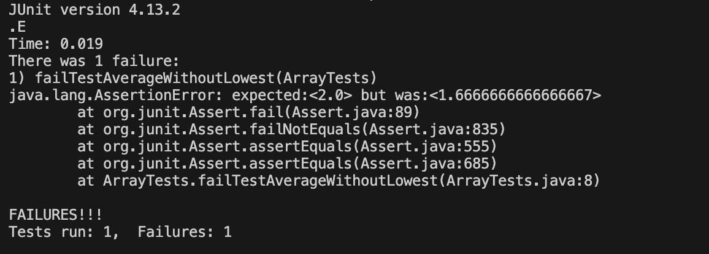
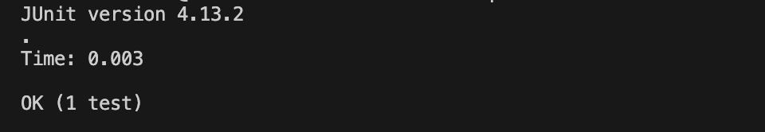
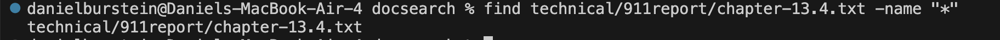
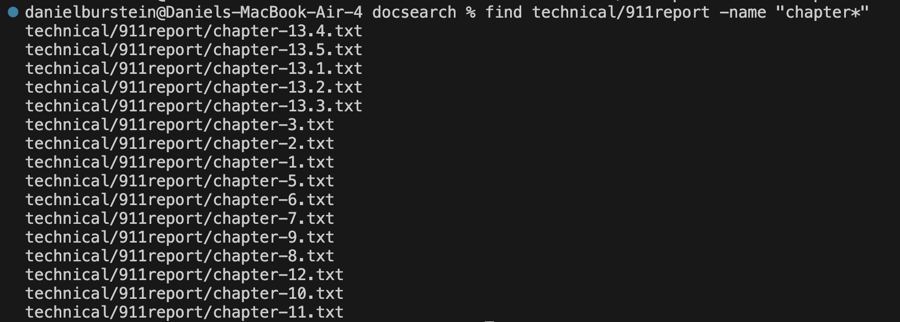

# Lab Report 3

---
**Part 1:**

1. A failing test:
  ~~~
  @Test
  public void failTestAverageWithoutLowest() {
    double[] input1 = {1,1,2,3};
    assertEquals(2.0, ArrayExamples.averageWithoutLowest(input1),0.000001);
  }
  ~~~
  Symptom:

2. A passing test:
  ~~~
  @Test
  public void passTestAverageWithoutLowest() {
    double[] input1 = {1,2,3,4};
    assertEquals(3.0, ArrayExamples.averageWithoutLowest(input1),0.000001);
  }
  ~~~
  Symptom:
  

3. Problematic Function:
  ~~~
    static double averageWithoutLowest(double[] arr) {
      if(arr.length < 2) { return 0.0; }
      double lowest = arr[0];
      for(double num: arr) {
        if(num < lowest) { lowest = num; }
      }
      double sum = 0;
      for(double num: arr) {
        if(num != lowest) { sum += num; }
      }
      return sum / (arr.length - 1);
     }
  ~~~
4. Fixed Function:
  ~~~
    static double averageWithoutLowest(double[] arr) {
      if(arr.length < 2) { return 0.0; }
      double lowest = arr[0];
      for(double num: arr) {
        if(num < lowest) { lowest = num; }
      }
      double sum = 0;
      for(double num: arr) {
        sum += num; 
      }
      sum -= lowest;
      return sum / (arr.length - 1);
    }
  ~~~
5. How it is fixed:
The problematic function failed in the situation when multiple numbers in the array were the lowest. For example, if the array was {1,1,3} it should remove only one of the ones which would give you an average of 2 but the problematic function ends up removing both the ones and returning an average of 3. This happened in the line `if(num != lowest) { sum += num; }` this check happens every time it wants to add any number to the sum but it doesn't take into account if 2 or more of the same number are the lowest. To fix this function I ended up removing the if statement which just adds all of the numbers together and then I just subtracted the lowest value one time at the end.

---
**Part 2:**

Find Command:

1. -name:

  File:
    

  Directory:
    

2. Option 2:
  File:

  Directory:

3. Option 3:
  File:

  Directory:

4. Option 4:
  File:

  Directory:

