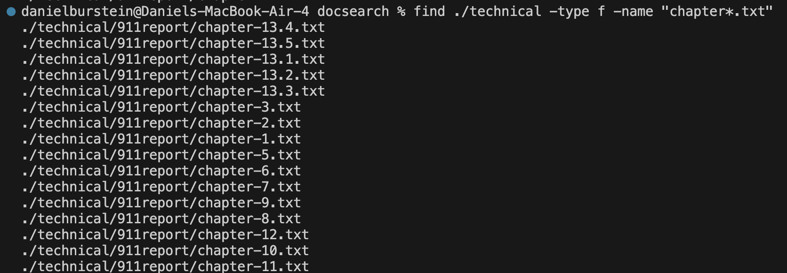
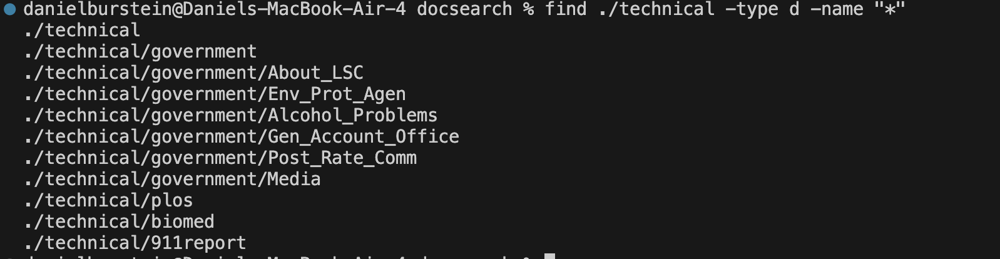
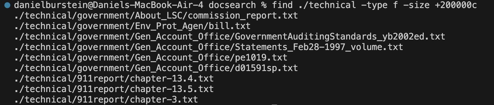
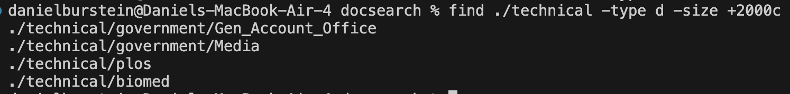
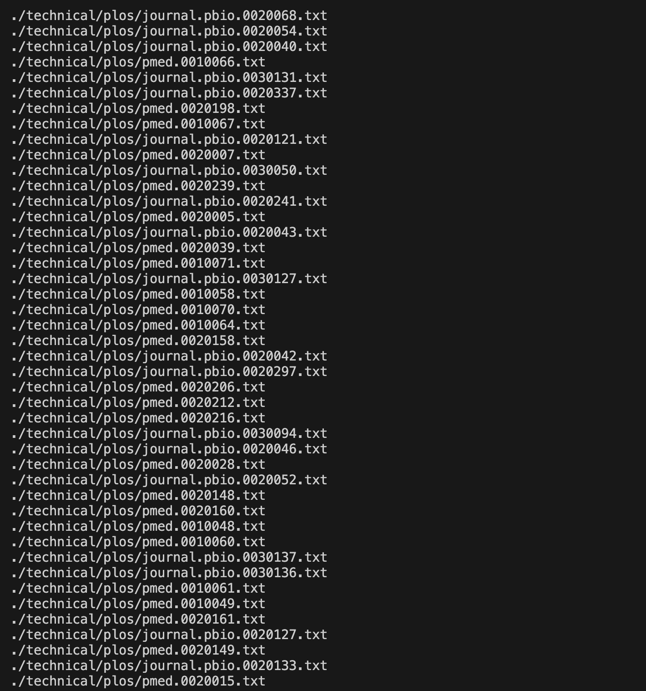
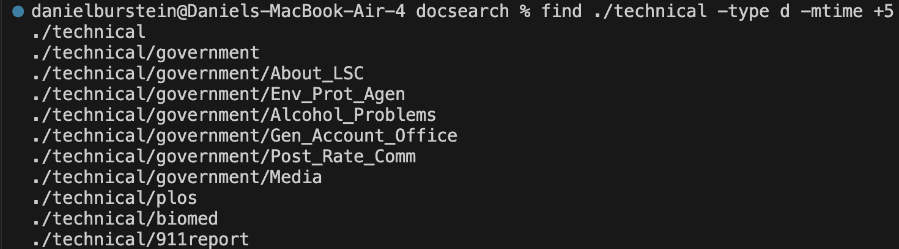
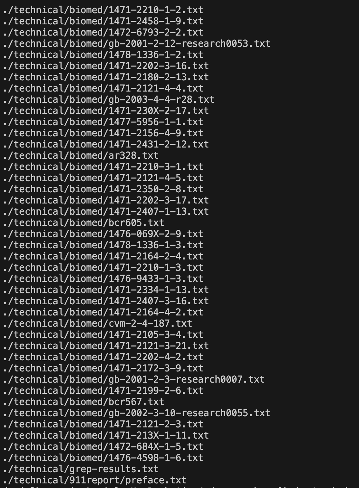
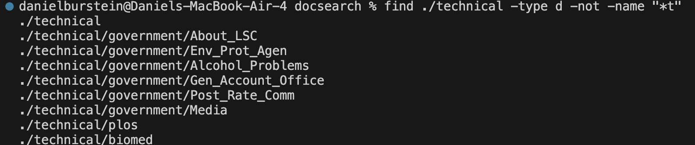

# Lab Report 3

[![GoBack]][Back]

---
**Part 1:**

1. A failing test:
  ~~~
  @Test
  public void failTestAverageWithoutLowest() {
    double[] input1 = {1,1,2,3};
    assertEquals(2.0, ArrayExamples.averageWithoutLowest(input1),0.000001);
  }
  ~~~
  Symptom:

2. A passing test:
  ~~~
  @Test
  public void passTestAverageWithoutLowest() {
    double[] input1 = {1,2,3,4};
    assertEquals(3.0, ArrayExamples.averageWithoutLowest(input1),0.000001);
  }
  ~~~
  Symptom:
  

3. Problematic Function:
  ~~~
    static double averageWithoutLowest(double[] arr) {
      if(arr.length < 2) { return 0.0; }
      double lowest = arr[0];
      for(double num: arr) {
        if(num < lowest) { lowest = num; }
      }
      double sum = 0;
      for(double num: arr) {
        if(num != lowest) { sum += num; }
      }
      return sum / (arr.length - 1);
     }
  ~~~
4. Fixed Function:
  ~~~
    static double averageWithoutLowest(double[] arr) {
      if(arr.length < 2) { return 0.0; }
      double lowest = arr[0];
      for(double num: arr) {
        if(num < lowest) { lowest = num; }
      }
      double sum = 0;
      for(double num: arr) {
        sum += num; 
      }
      sum -= lowest;
      return sum / (arr.length - 1);
    }
  ~~~
5. How it is fixed:
The problematic function failed in the situation when multiple numbers in the array were the lowest. For example, if the array was {1,1,3} it should remove only one of the ones which would give you an average of 2 but the problematic function ends up removing both the ones and returning an average of 3. This happened in the line `if(num != lowest) { sum += num; }` this check happens every time it wants to add any number to the sum but it doesn't take into account if 2 or more of the same number are the lowest. To fix this function I ended up removing the if statement which just adds all of the numbers together and then I just subtracted the lowest value one time at the end.

---
**Part 2:**

Find Command:

1. -name:

  File:
    

    > What's happening: The command "find ./technical -type f -name "chapter*.txt"" is looking recursively
    > through all the paths of files inside of /technical to see if it contains "chapter" + anything + ".txt".
    > Then it returns all of those paths.

  Directory:
    

      > What's happening: The command "find ./technical -type d -name "*"" is looking recursively
      > through all the paths of directories inside of /technical to see if they contain anything.
      > Then it returns all of those paths.

  Source:
  [linuxize](https://linuxize.com/post/how-to-find-files-in-linux-using-the-command-line/)

2. -size:
   
  File:
    

      > What's happening: The command "find ./technical -type f -size +200000c" is looking recursively
      > through all the paths of files inside of /technical to see if the file is larger than 200000 bytes.
      > Then it returns all of those paths.

  Directory:
    

      > What's happening: The command "find ./technical -type d -size +2000c" is looking recursively
      > through all the paths of directories inside of /technical to see if the directory is larger than 2000 bytes.
      > Then it returns all of those paths.

  Source:
  [linuxize](https://linuxize.com/post/how-to-find-files-in-linux-using-the-command-line/#:~:text=G%3A%20Gigabytes-,The%20following%20command%20will%20find,-all%20files%20of)

3. -mtime:
   
  File:
    
    

      > What's happening: The command "find ./technical -type f -mtime -7" is looking recursively
      > through all the paths of files inside of /technical to see if the file's last modification was within 7 days.
      > Then it returns all of those paths.
      
  Directory:
    
    
      > What's happening: The command "find ./technical -type d -mtime +5" is looking recursively
      > through all the paths of directories inside of /technical to see if the directory's last modification was more than 5 days ago.
      > Then it returns all of those paths. 

  Source:
    [linuxize](https://linuxize.com/post/how-to-find-files-in-linux-using-the-command-line/)

4. -not:

  File:
    
    

      > What's happening: The command "find ./technical -type f -not -name "chapter*.txt"" is looking recursively
      > through all the paths of files inside of /technical to see if the file's name does not contain "chapter" + anything + ".txt".
      > Then it returns all of those paths.

  Directory:
    

      > What's happening: The command "find ./technical -type d -not -name "*t"" is looking recursively
      > through all the paths of directories inside of /technical to see if the directory's name does not contain anything + "t".
      > This just removes all directory's that end in a "t". Then it returns all of those paths.

  Source:
    [linuxize](https://linuxize.com/post/how-to-find-files-in-linux-using-the-command-line/)

[![GoBack]][Back]

<!---------------------------------------------------------------------------->

[GoBack]: https://img.shields.io/badge/%E2%86%90%20Go%20Back-red
[Back]: https://danielburstein.github.io/cse15l-lab-reports/

