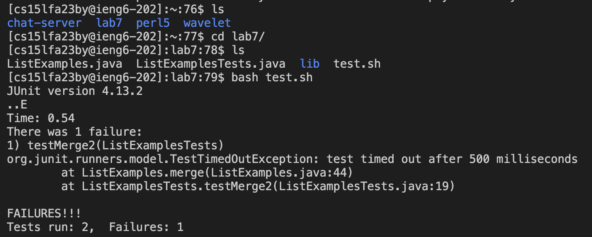
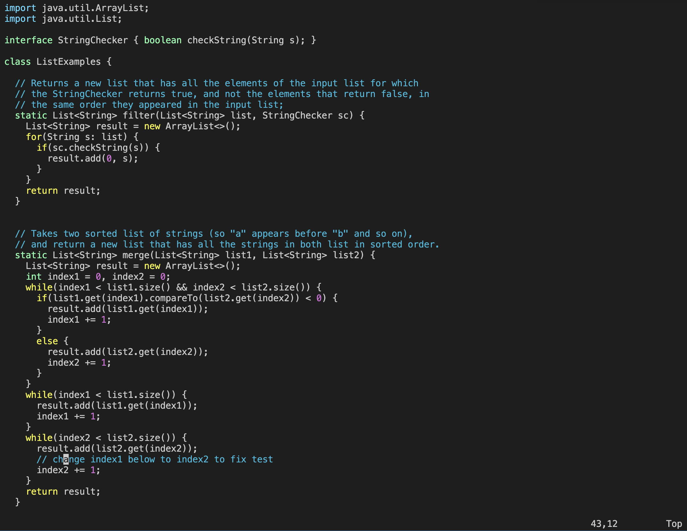
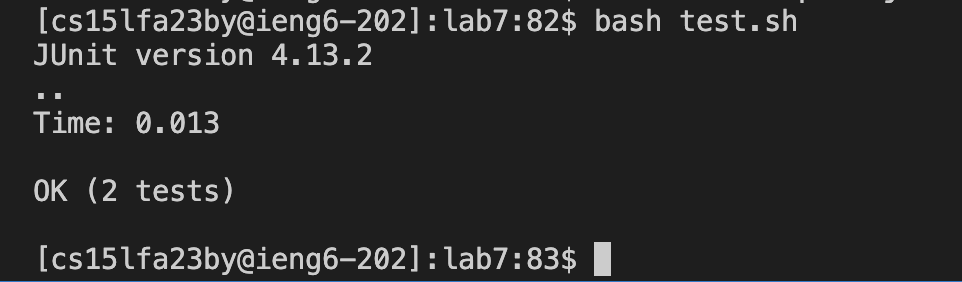
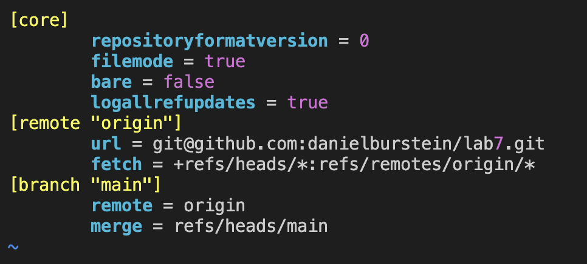

# Lab Report 4

---

1. Log into ieng6:
   
   Command:

   ``` ssh cs15lfa23by@ieng6.ucsd.ed ```  \<enter\>
   
   Result:
   
   
   
   Summary: Running this command would connect and log you into the remote ieng6 server.
   
3. Clone your fork :

   Locate the URL:
   
   
   
   Command:

   ``` git clone git@github.com:danielburstein/lab7.git ```  \<enter\>
   
   Summary: Running this command would create a copy of the project on our remote server.

5. Run the tests:

   Commands:
   
   ``` ls ```  \<enter\>
   ``` cd lab7/ ```  \<enter\>
   ``` ls ```  \<enter\>
   ``` bash test.sh  ```  \<enter\>
   
   Result:
   
   
   
   Summary: Running the `ls` command allowed me to see what was in the current directory I was in, this allowed me to locate the lab7
   directory which I switched into with the `cd` command then I re ran the `ls` command to see what was in the lab7 directory. I then ran
   `bash test.sh` to run the shell script file `test.sh`. This file had some commands inside of it so when I ran this file it ended up running the         commands needed which compiled and ran ListExamples.java and ListExamplesTests.java.
   
7. Edit the code:
   
   Based on the result of the previous commands we can see that not all of our tests are passing meaning there is a bug in our code.
   
   Command:
   
   ``` vim ListExamples.java  ```  \<enter\>
   
   Result:
   
   
   
   keys pressed:
   
   ```:44``` \<enter\>
   ```l l l l l```
   ```x i 2``` \<ecape\>
   ```:wq``` \<enter\>

   Summary: Running the `vim` command allows me to open up the file "ListExamples.java" in the vim menu and apply changes to it using vim commands.
   the `:44` command moves my cursor to the 44th line then clicking `l` moves my cursor to the right (I did this 5 times to be in the correct spot).
   After I am in the correct spot I clicked `x` which deletes the the character I am currently on, and then I hit `i` to enter insert mode then I hit
   `2` to insert the character 2 into my file. `\<escape\>` was then used to go back to command mode and then I used the command `:wq` to write and       quit.
   
9. Run the tests:
   
   Commands:
   
   ```\<up arrow key\>``` 
   ```\<up arrow key\>```
   ```\<enter\>``` 
   
   Result:
   
   
   
   Summary: The `bash test.sh` command was 2 up in the search history, so I used the up arrow to access it. So I reran the script which I ran earlier    and this time you can see that all our tests passed.

11. Commit and push:

   Commands:
   
   ```vim .git/config``` \<enter\>
   re open the github tab and \<click\> the copy button.
   ```:7``` \<enter\>
   ```dd```
   ```i``` \<enter\> \<up arrow key\>
   
   ```"u r l \<space\> = \<space\> \<ctrl + v\>```
   ```\<esc\> :wq``` \<enter\>
   
   Image:
   
   

   Commands:
   
   ```git add .``` \<enter\>
   ```git commit``` \<enter\>
   ```i```
   ```this is my commit message```
   ```\<escape\> :wq``` \<enter\>
   ```git push``` \<enter\>
   
   Summary: I reran the `vim` command  to open the git file. Then I went to line 7 with `:7` I then typed dd to delete the whole line. I then went       into insert mode with `i` and typed "url = " and then pasted the correct url. I lastly went into command mode again using `\<esc\>` and ran `:wq`     to   write and quit.
   After changing the git file I then use `git add` to add my changes and `git commit` to commit my changes, this commit command puts me in a file in    which I can change the commit message which I do using `i` (insert mode) and then writing my commit message. I lastly go back to command mode with
   `\<esc\>` and then save my changes with `:wq`. I lastly use the command `git push` which pushes my changes back to my github account.

---


