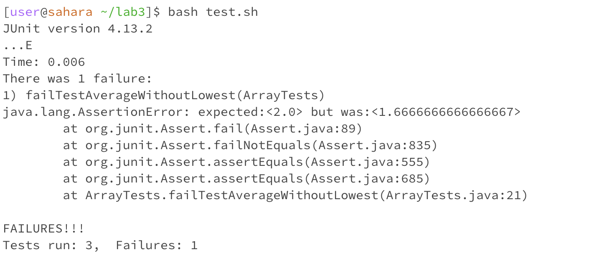
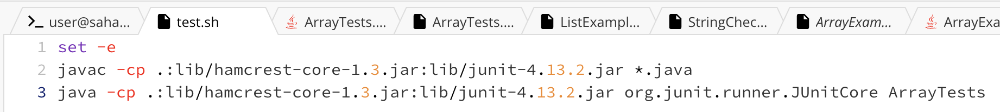
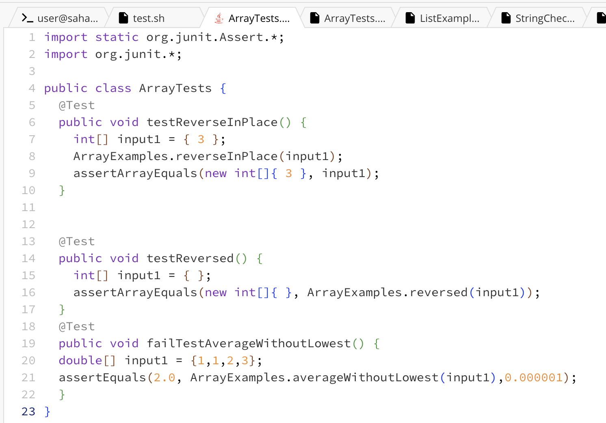
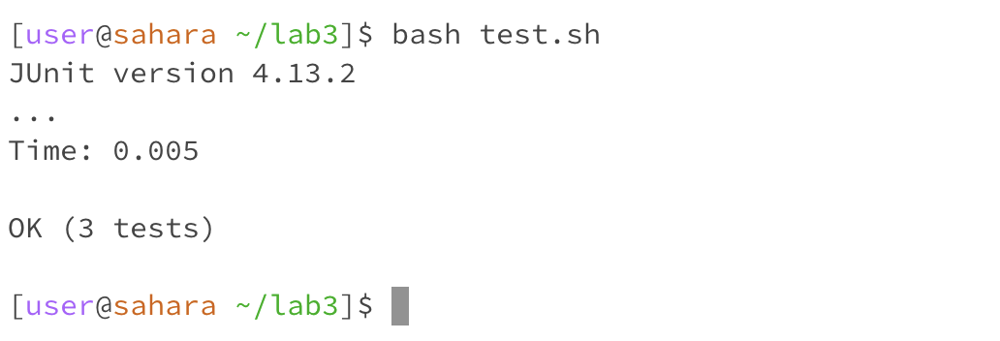

# Lab Report 5

---

**Part 1**

---

**Student Post**:
   
   > Hey, I am having trouble figuring out what is wrong. I am currently working on lab3 and when I run
   > the command `bash test.sh` into the terminal it is giving me a really big error. This is what it shows me:
   
   
   
   > I think I might have done something wrong in my "test.sh" or in my "ArrayTests.java" file
   > These are the images for what are in those files:

   

   

**TA Response**:

  > Hey, `Student` I see that you are getting an error when you run that bash command. Based on the output
  > in the terminal it seems like this isn't coming from your test.sh file but rather one of your   
  > assertions are failing. Specifically in the "failTestAverageWithoutLowest" function in your       
  > ArrayTests.java file. This means that when you ran averageWithoutLowest(input1) in that function the
  > output was not "2.0". So there seems to be a problem in your averageWithoutLowest function. I hope   
  > that helps!    

**Student Response**:

  > I went ahead and re checked my averageWithoutLowest function and you were right, I ended up not   
  > creating that function in the way that I wanted so it gave me the wrong result when I ran it.
  > I went ahead and changed that function and now when I run the command `bash test.sh` it all works.

  

  > Thank you soo much for your help!

**Setup Information**:

ArrayExamples.java file before:

~~~

public class ArrayExamples {

  // Changes the input array to be in reversed order
  static void reverseInPlace(int[] arr) {
    for(int i = 0; i < arr.length; i += 1) {
      arr[i] = arr[arr.length - i - 1];
    }
  }

  // Returns a *new* array with all the elements of the input array in reversed
  // order
  static int[] reversed(int[] arr) {
    int[] newArray = new int[arr.length];
    for(int i = 0; i < arr.length; i += 1) {
      arr[i] = newArray[arr.length - i - 1];
    }
    return arr;
  }

  // Averages the numbers in the array (takes the mean), but leaves out the
  // lowest number when calculating. Returns 0 if there are no elements or just
  // 1 element in the array
  static double averageWithoutLowest(double[] arr) {
    if(arr.length < 2) { return 0.0; }
    double lowest = arr[0];
    for(double num: arr) {
      if(num < lowest) { lowest = num; }
    }
    double sum = 0;
    for(double num: arr) {
      if(num != lowest) { sum += num; }
    }
    return sum / (arr.length - 1);
  }

}

~~~

ArrayExamples.java file after:

~~~
public class ArrayExamples {

  // Changes the input array to be in reversed order
  static void reverseInPlace(int[] arr) {
    for(int i = 0; i < arr.length; i += 1) {
      arr[i] = arr[arr.length - i - 1];
    }
  }

  // Returns a *new* array with all the elements of the input array in reversed
  // order
  static int[] reversed(int[] arr) {
    int[] newArray = new int[arr.length];
    for(int i = 0; i < arr.length; i += 1) {
      arr[i] = newArray[arr.length - i - 1];
    }
    return arr;
  }

  // Averages the numbers in the array (takes the mean), but leaves out the
  // lowest number when calculating. Returns 0 if there are no elements or just
  // 1 element in the array
  static double averageWithoutLowest(double[] arr) {
    boolean one = true;
    if(arr.length < 2) { return 0.0; }
    double lowest = arr[0];
    for(double num: arr) {
      if(num < lowest) { lowest = num; }
    }
    double sum = 0;
    for(double num: arr) {
      if(num == lowest && one) { one = false;}
     else {
      sum += num;
    }
    }
    return sum / (arr.length - 1);
  }

}
~~~

test.sh file:

~~~
set -e
javac -cp .:lib/hamcrest-core-1.3.jar:lib/junit-4.13.2.jar *.java
java -cp .:lib/hamcrest-core-1.3.jar:lib/junit-4.13.2.jar org.junit.runner.JUnitCore ArrayTests
~~~

ArrayTests.java file:

~~~
import static org.junit.Assert.*;
import org.junit.*;

public class ArrayTests {
	@Test 
	public void testReverseInPlace() {
    int[] input1 = { 3 };
    ArrayExamples.reverseInPlace(input1);
    assertArrayEquals(new int[]{ 3 }, input1);
	}

  @Test
  public void testReversed() {
    int[] input1 = { };
    assertArrayEquals(new int[]{ }, ArrayExamples.reversed(input1));
  }
  @Test
  public void failTestAverageWithoutLowest() {
  double[] input1 = {1,1,2,3};
  assertEquals(2.0, ArrayExamples.averageWithoutLowest(input1),0.000001);
  }
}
~~~

---

**Part 2**

---

**Reflection**

During lab in the second half of this quarter, I learned a lot of interesting things. One example is during lab 6, we had to setup 
a project that could take a github link as an input, pull it, and then run our tests on it and give it a grade. In this lab, I learned a lot about bash commands and more about
junit tests. I was running into an issue with junit tests and talking with a TA we ended up figuring out that we had to change the junit path as we wanted to access it
in a different directory this was really interesting to me as I didn't know you could cd in a .sh file and also showing this to another student who was on windows allowed
me to understand the differences between windows and mac for bash paths.
